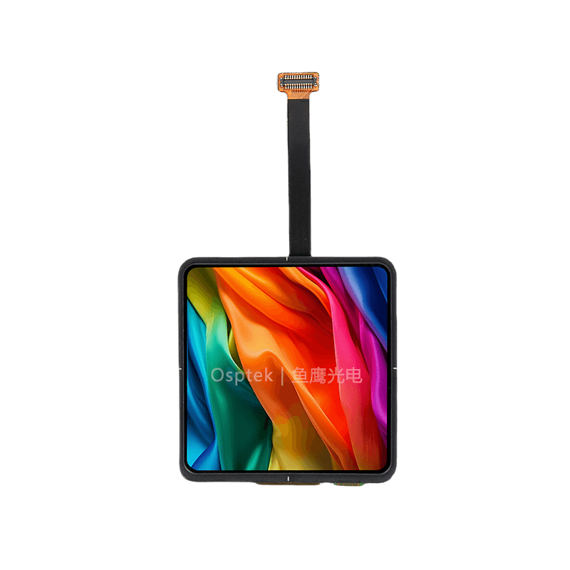
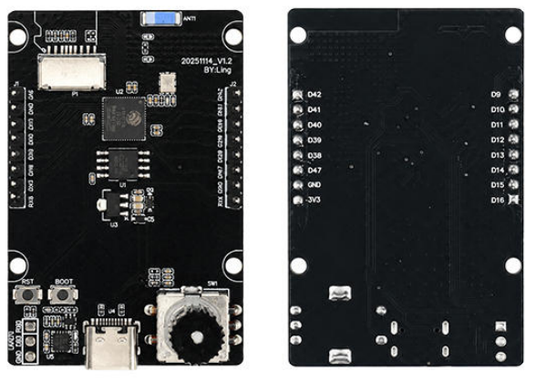
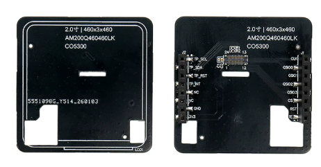
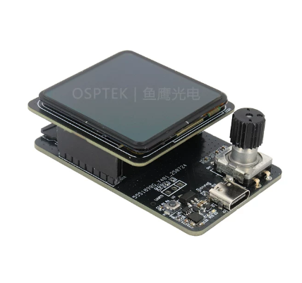

<p align="left"></p>

<h1 align="center">OSPTEK 2.0″ AMOLED 460×460 (CO5300 · QSPI)</h1>

<p align="center"><b>AMOLED module · QSPI · CO5300 · capacitive touch</b></p>

<p align="center"><a href="./README.md">简体中文</a> | English · <a href="../../README_EN.md">Family index</a></p>

<p align="center">
  
  
  
  
</p>

<p align="center"></p>

## Contents

- [Overview](#overview)
- [Specifications](#specifications)
- [Prebuilt firmware](#prebuilt-firmware)
- [Sample projects](#sample-projects)
- [Repository layout](#repository-layout)
- [Resources](#resources)
- [Buy](#buy)
- [Support](#support)

---

## Overview

OSPTEK **2.0″ 460×460 AMOLED** is a **QSPI** color display module driven by **CO5300**, with capacitive touch (**CST820**). Suited to handheld devices, wearables, and compact HMI.

Spec ID (repository name): `2.0-amoled-460x460-qspi-co5300`

Current module version: **AM200Q460460LK**. Electrical and mechanical details follow [`docs/AM_200_Q460460_LK_ed30462590.pdf`](./docs/AM_200_Q460460_LK_ed30462590.pdf).

## Specifications

| Item | Spec |
| ---- | ---- |
| Size | 2.0 inch |
| Type | AMOLED (color) |
| Resolution | 460×460 |
| Interface | QSPI |
| Driver IC | CO5300 |
| Touch driver | CST820 |

> Full outline, FPC definition, power, and timing follow the product datasheet / driver IC datasheet.

## Prebuilt firmware

Flash the merged image below to verify display and touch without building ESP-IDF.

**Intended hardware:** this module (AM200Q460460LK) + the **ESP32-S3 Demo board**. Other MCUs / wiring need a different firmware or your own port.

| Base board (ESP32-S3 Demo) | Adapter / module (AM200Q460460LK) | Assembled |
| -------------------------- | --------------------------------- | --------- |
|  |  |  |

**Pin map**

| Function | GPIO |
| -------- | ---- |
| LCD CS | 14 |
| LCD PCLK (CLK) | 9 |
| LCD DATA0 | 10 |
| LCD DATA1 | 11 |
| LCD DATA2 | 12 |
| LCD DATA3 | 13 |
| LCD RST | 15 |
| TOUCH SCL | 42 |
| TOUCH SDA | 41 |
| TOUCH RST | 40 |
| TOUCH INT | 39 |

| File | Address | Notes |
| ---- | ------- | ----- |
| [`firmware/esp32s3-2.0-amoled-460x460-qspi-co5300-bringup.bin`](./firmware/esp32s3-2.0-amoled-460x460-qspi-co5300-bringup.bin) | `0x0` (merged) | Bringup for the S3 Demo board + this module |

> Flash the merged image at **`0x0`**, not `0x10000`.

## Sample projects

| Description | Path |
| ---- | ---- |
| ESP32-S3 · CO5300 QSPI + LVGL8 | [`examples/esp32s3-idf5_co5300-qspi_lvgl8/`](./examples/esp32s3-idf5_co5300-qspi_lvgl8/) |
| ESP32-S3 · CO5300 QSPI + esp-lvgl-adapter / LVGL8 | [`examples/esp32s3-idf5_co5300-qspi_esp-lvgl-adapter_lvgl8/`](./examples/esp32s3-idf5_co5300-qspi_esp-lvgl-adapter_lvgl8/) |
| ESP32-S3 · CO5300 QSPI + esp-lvgl-adapter / LVGL9 | [`examples/esp32s3-idf5_co5300-qspi_esp-lvgl-adapter_lvgl9/`](./examples/esp32s3-idf5_co5300-qspi_esp-lvgl-adapter_lvgl9/) |
| ESP32-S3 · LVGL8 + TE | [`examples/with-te/esp32s3-idf5_co5300-qspi_esp-lvgl-adapter_lvgl8_amoled-with-te/`](./examples/with-te/esp32s3-idf5_co5300-qspi_esp-lvgl-adapter_lvgl8_amoled-with-te/) |
| ESP32-S3 · LVGL9 + TE | [`examples/with-te/esp32s3-idf5_co5300-qspi_esp-lvgl-adapter_lvgl9_amoled-with-te/`](./examples/with-te/esp32s3-idf5_co5300-qspi_esp-lvgl-adapter_lvgl9_amoled-with-te/) |
| ESP32-S3 · EAF boot animation | [`examples/eaf/esp32s3-idf5_co5300-qspi_eaf-boot-animation_spiffs_lvgl9/`](./examples/eaf/esp32s3-idf5_co5300-qspi_eaf-boot-animation_spiffs_lvgl9/) |
| ESP32-S3 · EAF player | [`examples/eaf/esp32s3-idf5_co5300-qspi_esp-lv-eaf-player_spiffs_lvgl9/`](./examples/eaf/esp32s3-idf5_co5300-qspi_esp-lv-eaf-player_spiffs_lvgl9/) |
| ESP32-S3 · FreeType font | [`examples/freetype/esp32s3-idf5_co5300-qspi_esp-lv-freetype_spiffs_lvgl9/`](./examples/freetype/esp32s3-idf5_co5300-qspi_esp-lv-freetype_spiffs_lvgl9/) |
| ESP32-S3 · JPG decoder | [`examples/jpg-decoder/esp32s3-idf5_co5300-qspi_esp-lv-decoder_spiffs_lvgl9/`](./examples/jpg-decoder/esp32s3-idf5_co5300-qspi_esp-lv-decoder_spiffs_lvgl9/) |
| ESP32-S3 · Lottie player | [`examples/lottie/esp32s3-idf5_co5300-qspi_esp-lv-lottie-player_spiffs_lvgl9/`](./examples/lottie/esp32s3-idf5_co5300-qspi_esp-lv-lottie-player_spiffs_lvgl9/) |

## Repository layout

```text
2.0-amoled-460x460-qspi-co5300/                                # repo root (nav: ../../README_EN.md)
└── versions/
    └── AM200Q460460LK/                                # full materials for this part number
        ├── README.md
        ├── README_EN.md
        ├── images/
        ├── docs/
        ├── firmware/
        └── examples/
```

## Resources

### Product files

| Resource | Link |
| ---- | ---- |
| Product datasheet (AM200Q460460LK) | [`docs/AM_200_Q460460_LK_ed30462590.pdf`](./docs/AM_200_Q460460_LK_ed30462590.pdf) |
| Driver IC datasheet (CO5300) | [`docs/CO_5300_Datasheet_V0_00_20230328_07edb82936.pdf`](./docs/CO_5300_Datasheet_V0_00_20230328_07edb82936.pdf) |
| Touch IC datasheet (CST820) | [`docs/DS_CST_820_V1_2_e0543732ca.pdf`](./docs/DS_CST_820_V1_2_e0543732ca.pdf) |
| Init sequence (text) | [`docs/code for AM200Q460460LK.txt`](./docs/code%20for%20AM200Q460460LK.txt) |
| 2.0″ AMOLED adapter board (V2.0) | [`docs/PCB-2.0寸AMOLED屏转接板V2.0.pdf`](./docs/PCB-2.0%E5%AF%B8AMOLED%E5%B1%8F%E8%BD%AC%E6%8E%A5%E6%9D%BFV2.0.pdf) |
| 3D model (STEP) | [`docs/AM_200_Q460460.step`](./docs/AM_200_Q460460.step) |
| Prebuilt firmware (ESP32-S3 merged) | [`firmware/esp32s3-2.0-amoled-460x460-qspi-co5300-bringup.bin`](./firmware/esp32s3-2.0-amoled-460x460-qspi-co5300-bringup.bin) |

### Samples

- [ESP32-S3 CO5300 QSPI + LVGL8](./examples/esp32s3-idf5_co5300-qspi_lvgl8/)
- [ESP32-S3 CO5300 QSPI + LVGL8 (adapter)](./examples/esp32s3-idf5_co5300-qspi_esp-lvgl-adapter_lvgl8/)
- [ESP32-S3 CO5300 QSPI + LVGL9 (adapter)](./examples/esp32s3-idf5_co5300-qspi_esp-lvgl-adapter_lvgl9/)
- [ESP32-S3 LVGL8 + TE](./examples/with-te/esp32s3-idf5_co5300-qspi_esp-lvgl-adapter_lvgl8_amoled-with-te/)
- [ESP32-S3 LVGL9 + TE](./examples/with-te/esp32s3-idf5_co5300-qspi_esp-lvgl-adapter_lvgl9_amoled-with-te/)
- [ESP32-S3 EAF boot animation](./examples/eaf/esp32s3-idf5_co5300-qspi_eaf-boot-animation_spiffs_lvgl9/)
- [ESP32-S3 EAF player](./examples/eaf/esp32s3-idf5_co5300-qspi_esp-lv-eaf-player_spiffs_lvgl9/)
- [ESP32-S3 FreeType](./examples/freetype/esp32s3-idf5_co5300-qspi_esp-lv-freetype_spiffs_lvgl9/)
- [ESP32-S3 JPG decoder](./examples/jpg-decoder/esp32s3-idf5_co5300-qspi_esp-lv-decoder_spiffs_lvgl9/)
- [ESP32-S3 Lottie](./examples/lottie/esp32s3-idf5_co5300-qspi_esp-lv-lottie-player_spiffs_lvgl9/)

## Buy

<p align="center">
  <a href="https://www.aliexpress.com/store/1105701619"></a>
  &nbsp;&nbsp;
  <a href="https://shop110742373.taobao.com/"></a>
</p>

**Overseas (AliExpress)**

- Store: [OSPTEK Official Store](https://www.aliexpress.com/store/1105701619)

**China (Taobao)**

- Store: [鱼鹰光电工厂店](https://shop110742373.taobao.com/)

## Support

- Technical support / product inquiry: <luyu@osptek.com>
- QQ group: **985881096**
- Website: <https://osptek.com/>
- Feel free to open an Issue in this repository with any questions

---

<p align="center"><sub>© 2026 OSPTEK · Materials in this repository are licensed under CC BY 4.0</sub></p>
